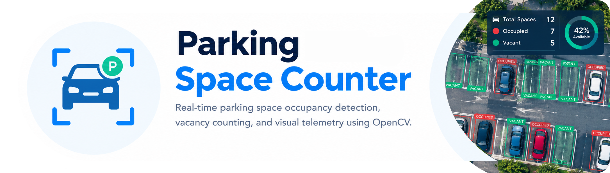
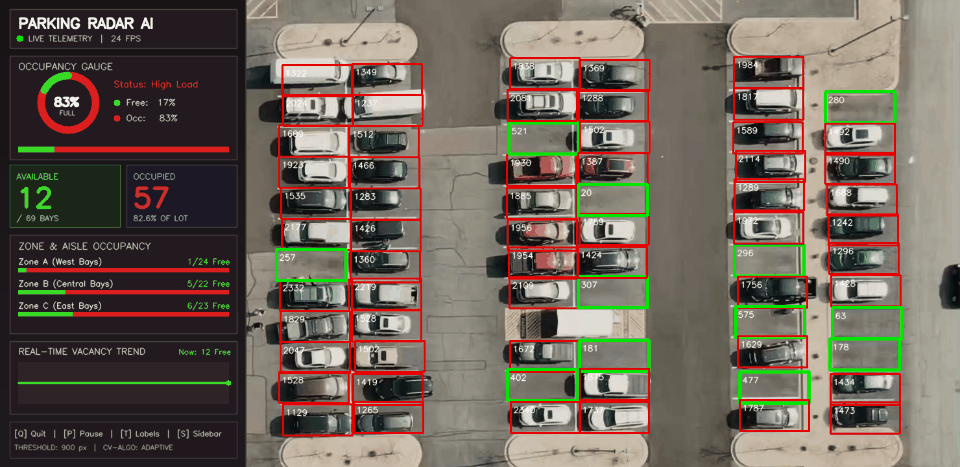

# **Parking Space Counter**

<div align="center"> 
   
</div>

<br/>

<div align="center"> 

Real-time parking space occupancy detection, vacancy counting, and visual telemetry using OpenCV.

[](https://python.org)
[](https://opencv.org)
[](https://numpy.org)
[](https://pandas.pydata.org)
[](https://jupyter.org)
[](LICENSE)

</div>

A high-performance Computer Vision system that automates parking lot occupancy tracking and vacancy monitoring from surveillance camera feeds. Using adaptive local thresholding, morphological edge dilation, and pixel density quantification, it classifies parking spots in real-time with sub-millisecond latency without requiring heavy deep neural networks or dedicated GPUs.

## Demo

<p align="center">
  
</p>

## Features

- **Real-Time Occupancy Classification**: Live evaluation of 69 designated parking bays at 60+ FPS on consumer-grade CPUs.
- **Sleek Left Telemetry Sidebar Dashboard**: Features a live circular Donut gauge, high-contrast KPI cards, zone-level aisle breakdowns, and a real-time rolling vacancy trend sparkline.
- **Adaptive Contrast Thresholding**: Local neighborhood thresholding handles dynamic outdoor lighting, harsh sunlight glares, and tree shadows.
- **Interactive Calibration Tool**: Built-in graphical space picker (`ParkingSpacePicker.py`) with an on-screen HUD for easy click-to-annotate bounding box configuration.
- **Visual Telemetry & HUD Overlay**: Live dashboard displaying vacant vs. occupied spot tallies and color-coded status bounding boxes (Green = Free, Red = Occupied).
- **Comprehensive Analytics Notebook**: Complete Jupyter Notebook walkthrough with step-by-step pipeline visualizations, bimodal threshold distributions, and temporal video tracking.
- **Lightweight & Edge Ready**: Zero GPU dependencies; ideal for microcomputers such as Raspberry Pi, Jetson Nano, and embedded surveillance setups.

## System Pipeline

```
  Surveillance Video / Image
              │
              ▼
    [ Grayscale Conversion ]  ──▶  Reduces 3 channels to 1 intensity channel
              │
              ▼
     [ Gaussian Blur (3x3) ]  ──▶  Suppresses high-frequency sensor noise
              │
              ▼
   [ Adaptive Thresholding ]  ──▶  Calculates local contrast threshold per 25x25 window
              │
              ▼
      [ Median Blur (5x5) ]   ──▶  Eliminates salt-and-pepper noise specks
              │
              ▼
    [ Morphological Dilation] ──▶  Expands vehicle edges and fills contour gaps
              │
              ▼
     [ Slot Pixel Counting ]  ──▶  cv2.countNonZero(crop)
              │
      ┌───────┴───────┐
      ▼               ▼
Count < 900     Count >= 900
   [FREE]        [OCCUPIED]
  (Green)          (Red)
```

| Stage | Operation | OpenCV Function | Purpose |
|:---:|:---|:---|:---|
| **1** | Grayscale | `cv2.cvtColor(img, cv2.COLOR_BGR2GRAY)` | Reduces 3 color channels to single luminance channel (66% compute saving) |
| **2** | Noise Filtering | `cv2.GaussianBlur(gray, (3, 3), 1)` | Smooths out high-frequency camera noise while preserving structure |
| **3** | Illumination Handling | `cv2.adaptiveThreshold(...)` | Local Gaussian thresholding ($25 \times 25$ block) robust against outdoor shadows |
| **4** | Salt-and-Pepper Removal| `cv2.medianBlur(thresh, 5)` | Non-linear filtering removing isolated speckle pixels |
| **5** | Feature Dilation | `cv2.dilate(median, kernel, 1)` | Expands edge lines to bridge gaps in car body contours |
| **6** | Density Quantification | `cv2.countNonZero(crop)` | Quantifies white pixels against threshold ($<900$ = Free, $\ge 900$ = Occupied) |

## Getting Started

### Installation

Clone the repository and install dependencies:

```bash
pip install -r requirements.txt
```

Or using `uv`:

```bash
uv pip install -r requirements.txt
```

### Running the Application

```bash
# Run the live parking space counter demo (default video)
python main.py

# Launch the interactive parking slot calibration tool
python main.py --picker

# Run with a custom video file and custom coordinates file
python main.py --video asset/carPark.mp4 --pos asset/CarParkPos
```

> **Note:** To exit the live counter or calibration tool at any time, press `[Q]` or `[ESC]` on your keyboard while the window is focused.

## Calibration Controls (Space Picker)

When running `python main.py --picker` (or `python src/ParkingSpacePicker.py`):

| Action | Control | Description |
|:---|:---:|:---|
| **Add Parking Slot** | `Left-Click` | Creates a new calibrated bounding box ($107 \times 48\text{ px}$) at click coordinate |
| **Remove Parking Slot** | `Right-Click` | Removes the parking box containing the cursor |
| **Save & Exit** | `Q` or `ESC` | Saves updated coordinates to `asset/CarParkPos` and closes the tool |

## Keyboard Controls

| Key | Context | Action |
|:---:|:---|:---|
| `Q` / `ESC` | Live Counter / Space Picker | Exit application and save state |
| `P` / `SPACE` | Live Counter | Pause / Resume video playback |
| `T` | Live Counter | Toggle numeric pixel count labels inside slots |
| `S` | Live Counter | Toggle left sidebar dashboard on/off |

## Project Structure

```
.
├── asset/
│   ├── CarParkPos                 # Serialized pickle file of 69 parking coordinates
│   ├── carPark.mp4                # Surveillance video footage (679 frames, 24 FPS)
│   ├── carParkImg.png             # Reference parking lot image (1100 x 720 px)
│   ├── demo.gif                   # Animated live demonstration GIF
│   └── demo_preview.png           # Annotated parking lot preview banner

│
├── notebooks/
│   └── 01_parking_space_detection.ipynb  # Comprehensive EDA, pipeline stages & plots
│
├── src/
│   ├── __init__.py                # Package exports and constants
│   ├── counter_logic.py           # Core preprocessing & occupancy detection functions
│   └── ParkingSpacePicker.py      # Interactive parking space calibration tool
│
├── main.py                        # Clean CLI entry point with argparse options
├── requirements.txt               # Python package dependencies
└── README.md                      # Documentation & instructions
```
---

## License

This repository is licensed under the **MIT License**. See the [`LICENSE`](LICENSE) file for complete details.

---

## Connect with Me

<div align="center">

[](https://mohdfaizy.vercel.app)
[](https://www.linkedin.com/in/mohd-faizy/)
[](https://github.com/mohd-faizy)
[](https://www.credly.com/users/mohd-faizy)
[](https://twitter.com/F4izy)
[](https://ai.stackexchange.com/users/36737/faizy)

</div>
